# GBA WoW

A private hobby project: a World of Warcraft-inspired open-world RPG for the Game Boy Advance,
written in C++ with [Butano](https://github.com/GValiente/butano). It will never be published.


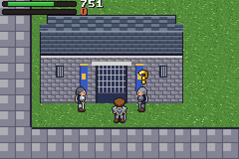
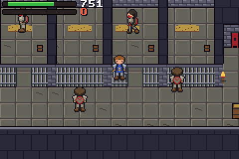
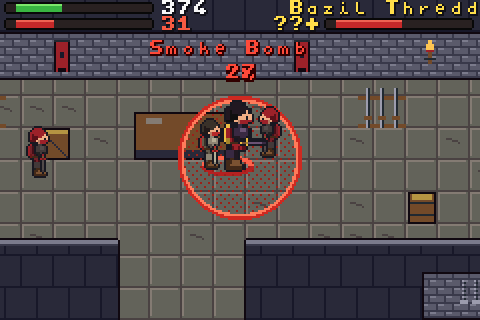
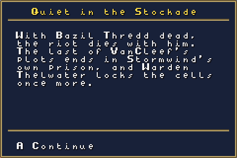
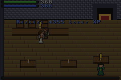
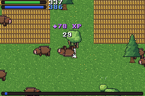
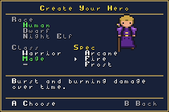
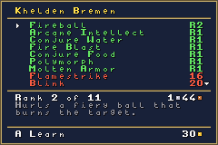
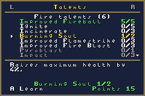
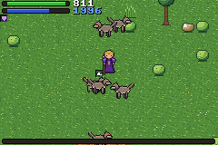
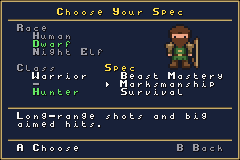
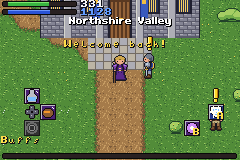
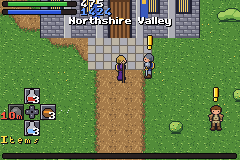
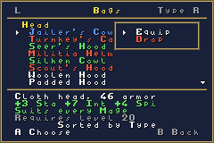
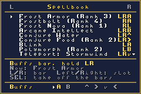
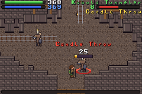
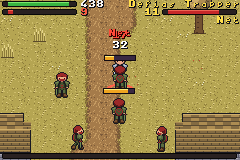
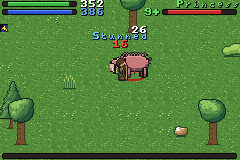
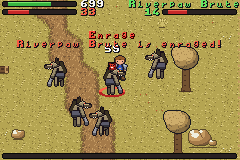
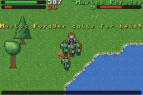
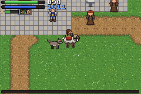
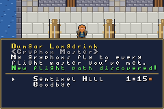
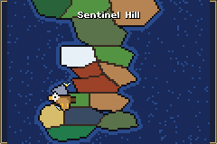
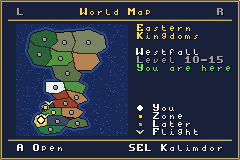
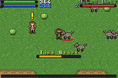
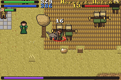
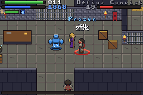
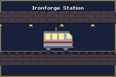
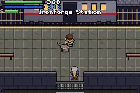
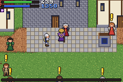
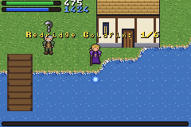
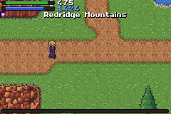
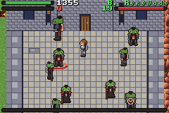
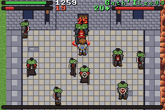
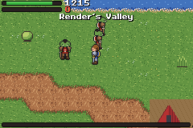
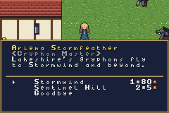
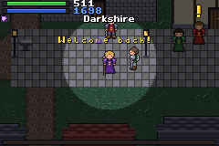
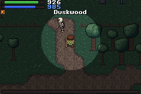
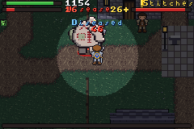
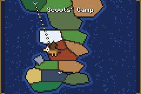
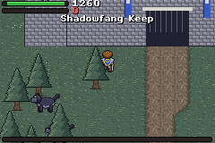
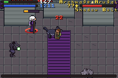

## Status

Every milestone of the roadmap is in. From the title screen, continue your saved hero or create a
Human Warrior or Mage, a Dwarf Warrior or Hunter, or a Night Elf Warrior or Hunter in one of three
subclasses (Arms, Fury or Protection; Arcane, Fire or Frost; Beast Mastery, Marksmanship or Survival),
then walk freely from Northshire Abbey down to Goldshire, west to the city of Stormwind, south to
Westfall, east to the Redridge Mountains and south to Duskwood, take on 59 quests from Northshire to
Shadowfang Keep, fight with auto-attack and your subclass's abilities, loot and equip about 290 items,
buy and sell at
vendors, carry as much as you like in bags sorted by type, quality, level or age, use 19 ability
slots on three bars and 4 item slots, buy new abilities and ranks from your class trainer, spend
talent points from level 10, face the elites Princess, Hogger, Gath'Ilzogg, Mor'Ladim and Stitches,
clear the kobolds out of Echo Ridge and Fargodeep mines, hunt for 26 hidden treasure chests, fish in
Lake Everstill, hearth home to an inn, ride from level 30, fly by gryphon between Stormwind, Sentinel
Hill, Lakeshire, Darkshire and Silverpine Forest, take the Deeprun Tram, tame a pet as a Beast Mastery
hunter, fight through the Deadmines to Sneed and Edwin VanCleef, put down the riot in Stormwind's
Stockade and its leader Bazil Thredd, keep the night off Darkshire, climb Shadowfang Keep to
Archmage Arugal, and save to the cartridge. Every zone has its own music, and elite fights switch to
a boss tune.

Following the quests in order takes a hero to level 15 at the end of Westfall, about 19 after
Redridge, 20 after the Deadmines, 21 in the Stockade, about 25 at the door of Shadowfang Keep and 26
after Arugal, without grinding. The level cap is 60: the
road there is planned in [docs/level-60-roadmap.md](docs/level-60-roadmap.md) (milestones M12 to M26).

| Milestone | What it adds | State |
| --- | --- | --- |
| M0 Toolchain ready | Butano + devkitARM build, CI | Done |
| M1 Free movement | 8-direction pixel movement, collision, camera | Done |
| M2 Open world | Elwynn Forest, Westfall, interiors, doors, area names | Done |
| M3 First playable: combat | Auto-attack, Heroic Strike, rage, wolves | Done |
| M4 Quests and NPCs | Dialogue, quest log, XP rewards | Done |
| M5 Levels, gear and trainers | Stats, equipment, loot, vendors, skill trainer, saves | Done |
| M6 Talents and second area | Warrior talent trees, Westfall-style area | Done |
| M7 Dungeon and boss | Dungeon interior, multi-phase boss | Done |
| M8 More races and classes | Character creation, Dwarf, Night Elf, Mage, Hunter | Done |
| M9 Polish | Title screen, music, sound effects, balance | Done |
| M10 Stormwind and exploration | Stormwind city, mine maps, hidden chests, world map, more trees and bushes | Done |
| M11 The Stockade | Second dungeon under Stormwind, three bosses, final quest chain and new ending | Done |
| M12 Systems for 60 | Level cap 60, XP curve to 60, rested XP, 16-bit ids, save version 4 | Done |
| M13 Subclasses and ranks | Subclass choice, 9 kits, ability ranks, 18-talent trees | Done |
| M14 Keybinds and bags | Utility, Buffs and Items bars, buff reminder, unlimited sorted bags | Done |
| M15 Enemy abilities | Shared enemy ability table, cast bars, interrupts, flee and call for help | Done |
| M16 Travel and the pet | Flight masters, boats, tram, mount, two-level world map, hunter pet | Done |
| M17 Redridge | Redridge Mountains and Lakeshire (15 to 20), 13 quests, fishing, the orcs of Stonewatch Keep, retuned Deadmines, end of chapter one | Done |
| M18 Duskwood | Duskwood at night and Darkshire (20 to 25), 17 quests, Stitches walking to town, Silverpine Forest and Shadowfang Keep with six bosses | Done |
| M19 to M26 | The Wetlands to the Plaguelands, 17 new dungeons, Onyxia and the new ending | Planned |

## Controls

| Button | Action |
| --- | --- |
| D-pad | Walk (8 directions) |
| B (hold) | Run (out of combat) |
| A | Talk to someone next to you, loot a corpse, fish when facing water, or attack the nearest enemy |
| L (tap) | Switch target |
| R (hold) | Combat bar: then A, B, L or a D-pad direction uses that slot |
| L (hold) | Utility bar: then A, B or a D-pad direction |
| L and R (hold) | Buffs bar: then A, B or a D-pad direction |
| Select (hold) | Items bar: then a D-pad direction (healing potion, food, drink, hearthstone unless changed) |
| Select (tap) | A healing potion in combat, otherwise food or drink |
| Start | Menu: character, bags, spellbook, talents, quest log, world map and system pages (L and R switch pages) |

Bars: holding a bar's buttons shows its icons around a small cross, placed like the buttons that use
them, with cooldowns and item counts on the icons. New abilities go on their own bar: your rotation
on Combat, interrupts, crowd control and long cooldowns on Utility, and long buffs, conjuring and
Teleport on Buffs. In the spellbook, A puts a spell on any slot: L and R pick the bar, left and right
the slot, Select takes it off. While one of your long buffs (shout, intellect, armor, aspect) is
missing out of combat, its icon blinks beside the health bar. Saves from before the three bars move
their buffs and utility abilities off the Combat bar the first time they load.

Bags: they never fill up. Each item takes one row with its count (up to 999 per row). On the Bags
page, Select sorts by type (with headings from Head to Junk), quality, required level or newest
first, and the game remembers the choice; up and down move one row, left and right a whole group.
A opens the item's actions: Use, Equip, Item bar (choose a direction for the Items bar) or Drop.
Vendors list the bags the same way, and Select there still sells all junk.

Subclasses: each class has three, chosen when creating the hero. A subclass decides which abilities
the class trainer teaches (a Fire Mage never sees Frostbolt) and which talent tree you get. Warriors
fight in their subclass's stance: Battle for Arms, Berserker for Fury (more crits, more damage taken)
and Defensive for Protection (less damage taken). Saves from before subclasses ask for one the first
time they load, with the tree that had the most talent points preselected, and refund the talents.

Ranks: abilities have ranks, as in WoW. Trainers sell each new rank once you reach its level; a blue
"!" over a trainer means something new is waiting, and the spellbook shows the rank you know.

Talents: every level from 10 gives a point, 51 by level 60. Each subclass has one tree of 18 talents
in seven tiers; the next tier opens every five points, and some talents teach an ability (Mortal
Strike, Pyroblast, Wyvern Sting and others). Class trainers unlearn talents for 10 silver.

The hearthstone in your bags takes you back to your home inn every ten minutes; innkeepers in
Goldshire, Stormwind's Trade District, at Sentinel Hill, in Lakeshire and in Darkshire can make their inn
your home.

Rested experience: ask an innkeeper to let you rest a while (or save and switch off inside an inn).
Every six minutes played since your last rest becomes 5% of a level of rested experience, up to a
level and a half. While you are rested the experience bar turns blue and kills give double experience
until the rested pool runs out. Resting also restores your health and mana.

Stormwind is reached by the road west from Goldshire. Its districts have weapon, armor and goods
vendors, a trainer for every class, and the quest givers who send you on to Highlord Bolvar in the keep.

Treasure chests are hidden around the world: under roofs, behind buildings, at the end of side
tunnels, and in clearings reached by secret paths through the forests (look for gaps between tree
trunks). Walk up to a chest and press A to open it for money, an item and sometimes a potion. Each
chest opens once per hero. The world map (Start, then the World Map page) shows where you are, quest
givers with a `!` or `?`, the chests you have already opened, the flight masters you know, and how
many of the 26 you have found; left and right show the other zones. B steps out to the whole
continent: the D-pad picks a zone (its levels, or "Coming later" for zones of later chapters), A
opens its map, and Select turns to Kalimdor. Brann Bronzebeard in Stormwind pays for five opened
chests.

Getting around: from level 30, Randal Hunter in Stormwind's Valley of Heroes teaches riding for 5
gold. Mount (on the Buffs bar) puts a Human on a horse, a Dwarf on a ram and a Night Elf on a
nightsaber, 60% faster out of combat; a blow, any other ability, eating, the hearthstone or going
indoors gets you off. Gryphon masters (Dungar Longdrink in the Valley of Heroes, Thor at Sentinel
Hill, Ariena Stormfeather in Lakeshire, Felicia Maline in Darkshire, Gryphon Rider Hask at the scouts'
camp in Silverpine) remember you the first time you talk to them and fly you to any other one you have
met, for a price that grows with the distance: the gryphon crosses the continent while the map scrolls under it.
The Deeprun Tram leaves from the station house in Stormwind's Dwarven District. Its far end is
Ironforge Station, where the lift up to Ironforge stays shut until the Ironforge chapter. Boats work
the same way and arrive with the harbors of later chapters.

Pets: a Beast Mastery hunter gets *Taming the Beast* from Einris Brightspear at level 10. Tame Beast
(Utility bar) channels for six seconds on a beast of your level or lower, which fights back
meanwhile; then it is yours, follows you everywhere and grows with you. It bites what you fight and
holds the attention of what it bites, so enemies turn on it instead of you. Its health shows under
yours. Call Pet sends it away or brings it back, Pet Passive keeps it out of fights, Revive Pet
brings it back from the dead, Mend Pet heals it, Kill Command makes its next bite hit hard, and the
Intimidation talent makes it stun. Aspect of the Beast adds 10% damage for both of you. A Frost
mage's last talent, Water Elemental, calls a pet for 45 seconds that casts Frostbolt at your target
and freezes enemies that reach you.

Enemies: many of them now do more than swing. Defias Thugs open wounds that bleed, Forest Spiders
poison, Kobold Tunnelers throw the candles off their helmets, Defias Trappers throw nets that root
you, Riverpaw Gnolls thrash, Defias Pirates cleave, Riverpaw Brutes enrage at 30% health, and
Rockhide Boars and Princess charge in from range and stun you for a moment. Murlocs call for help,
and murlocs, gnolls and kobolds run off at 15% health to bring a friend back with them. Elites have
two abilities: Hogger thrashes and knocks you down, Targorr charges and his Mortal Strike halves
your healing, and Kam Deepfury knocks you down and raises Shield Wall. A cast shows a bar over the
enemy's head and its name under the target's frame: yellow when an interrupt (Pummel, Shield Bash,
Counterspell or Scatter Shot) can stop it, gray when not; a stun, Polymorph or Wyvern Sting stops
any cast. What enemies put on you (rooted, stunned, bleeding, poisoned and the like) shows on its
own row under your buffs.

Bosses: Sneed calls an engineer at two thirds of his health and, from half health, throws saw blades
at the spot marked on the ground under you. Edwin VanCleef calls a Blackguard at 70% and 30% and, from
half health, marks a whirl of blades around himself. Step out of the red circle before it goes off.

The Stockade: after Edwin VanCleef, Gryan Stoutmantle hands you a letter for Warden Thelwater, who
waits at the prison gatehouse in Stormwind's Mage Quarter. The riot inside is level 20 content.
Targorr goes into a frenzy at half health, Kam Deepfury raises his shield before a heavy Shield
Slam, and Bazil Thredd throws smoke bombs at your feet from the start of the fight, calls a rioter
at two thirds and one third of his health, and frenzies near the end. Clear his two guards first and
bring healing potions. Bring his head to Highlord Bolvar to finish the story.

Redridge Mountains: the road east out of Elwynn, past Stonefield Farm, climbs to Three Corners and
on to Lakeshire, on the shore of Lake Everstill. Gryan Stoutmantle sends you there once you have found
the Defias hideout, and Magistrate Solomon, Marshal Marris and the townsfolk have 13 quests for levels
15 to 20: gnolls in the canyons and at Alther's Mill, murlocs on the shore, boars and spiders in the
hills, Bellygrub the giant boar, and the Blackrock orcs of Render's Valley and Stonewatch Keep, whose
warlord Gath'Ilzogg is an elite with a cleave and a war stomp. Ribchaser is a rare gnoll: his frame
says Rare, and he drops like an elite. To fish, stand at the edge of any lake or river out of combat,
face the water and press A: the line takes three seconds, and moving or a blow scares the fish. Bray
the Fisherman's contest wants six Redridge Goldfin from Lake Everstill, with his lucky hat as the
prize. Afterwards Solomon sends you back to Westfall for the Deadmines, which are now level 16 to 20;
the Stockade stays at 20.

The end of the first chapter: after Bazil Thredd, the epilogue tells what became of Westfall, of
Lakeshire if you freed it, and of the Stockade, then where the story goes next.

Duskwood: after Bazil Thredd, Highlord Bolvar sends you down the south road out of Elwynn, over the
Darkened Bank, to Lord Ello Ebonlocke in Darkshire (a second road comes down from Redridge). It is
always night in Duskwood: the world is dark outside a lantern-sized circle of light around you, which
flickers a little. Darkshire has an inn, a smith, a vendor, the Night Watch and a gryphon master, and
17 quests for levels 20 to 26: dire wolves on the roads, skeletons in Raven Hill Cemetery, ghouls in
the Tranquil Gardens, the Nightbane worgen of Brightwood Grove, spiders in Twilight Grove and the
Splinter Fist ogres of Vul'Gol. Madame Eva tells the legend of Stalvan Mistmantle, Sven Yorgen wants
the skull of the elite Mor'Ladim, and Sirra Von'Indi brews a bane for Morbent Fel, whom weapons barely
scratch until you carry it. Old Abercrombie's errand on Raven Hill ends with Stitches: once Ello
sends you after it, the abomination walks the road from the hermit's hut to Darkshire's gate, resting
at each bend, and waits there for you.

Shadowfang Keep: there is no road to Silverpine Forest. Once the worgen of Brightwood Grove are dealt
with, Ello's *Into Shadowfang* marks the scouts' camp on the gryphon masters' maps, and Felicia flies
you there; Ranger Valdan waits below the keep.
Inside, Rethilgore rears up before a heavy maul, Razorclaw the Butcher spins his cleavers from half
health, Baron Silverlaine drops a Veil of Shadow where you stand, Commander Springvale heals himself
(interrupt him) and shields himself near the end, Odo the Blindwatcher howls and frenzies, and
Archmage Arugal steps from ledge to ledge of his chamber with a Shadow Port every few seconds and calls
a Lupine Horror at two thirds and one third of his health. Bringing his head to Valdan ends the
chapter with a new page of the epilogue.

Auto-attack keeps going after a kill if another enemy is on you, and turns to whoever is hitting you
when your target is out of reach.

On the title screen, Continue loads your hero; New Game asks before it replaces the save, and backing
out of character creation returns to the title.

The game saves itself whenever you change zones or turn in a quest, and from the system page. The
system page also has debug options for testing: teleport, level up, extra gold, gear for your level
(without the epic quest rewards), every rank the trainer would teach, and a bagful of random loot.

Saves from every earlier version load: the first time an old save is loaded it is converted, and the
old copy stays on the cartridge until the game has saved twice in the new format. The game keeps two
save slots and writes them in turn, so a save cut short by switching off leaves the previous one.

## Building

The ROM is built by CI on every push: open the latest run under **Actions** and download the
`gba-wow-rom` artifact. To build locally you need the Butano submodule:

```sh
git clone --recurse-submodules https://github.com/mauricelux/gba-wow.git
cd gba-wow
```

Then either use Docker (nothing else to install):

```sh
docker run --rm -v "$PWD":/src -w /src devkitpro/devkitarm make -j4
```

or install [devkitPro](https://devkitpro.org/wiki/Getting_Started) with devkitARM and Python 3 and run `make -j4`.

Run `gba-wow.gba` in [mGBA](https://mgba.io/).

The headless runner in `tools/headless/` can start from a save file: set `MGBA_SAVE=path/to/gba-wow.sav`
before running it. `tools/headless/check_save.py` prints the hero stored in a save file and can check
it (`check_save.py gba-wow.sav level=12 class=Hunter`); CI uses it with an old version 3 save from
`tools/headless/saves/` to make sure old saves still load.

## Project layout

| Path | Contents |
| --- | --- |
| `src/`, `include/` | Game code (`gw_` prefix, namespace `gw`) |
| `graphics/` | Butano assets: indexed BMP + JSON per asset |
| `audio/` | Music (ProTracker `.mod`) and sound effects (`.wav`) |
| `tools/` | Python generators for the placeholder art and collision map |
| `tools/headless/` | Headless mGBA runner used by CI for screenshots |
| `butano/` | Butano engine (git submodule, pinned to a release) |

## Placeholder art

Character sprites, UI tiles, effects, the title logo, every map (art, collision, warps, NPC and enemy
spawns, named areas) and all music and sound effects are generated by scripts so they can be changed
quickly until real assets exist. To regenerate them (needs Python 3 with Pillow and NumPy):

```sh
cd tools
python3 gen_characters.py
python3 gen_ui.py
python3 gen_effects.py
python3 gen_title.py
python3 gen_world.py
python3 gen_audio.py
```

`gen_world.py` lays out the maps; `worldgen.py` holds the painters (trees, houses, roads, water) and
writes `graphics/map_*`, the `graphics/minimap_*` world map pictures, and the `include/gw_map_*.h`
data headers. It also checks that every NPC and chest can be walked to. `gen_audio.py` writes each tune as
chords, a melody and accompaniment styles into a ProTracker `audio/*.mod`, plus short `audio/sfx_*.wav`
sound effects; the tunes are original.

Previews are written to `tools/preview/` (not committed).
