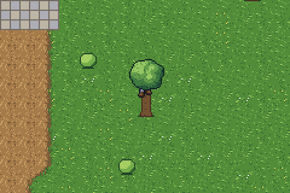

# GBA WoW

A private hobby project: a World of Warcraft-inspired open-world RPG for the Game Boy Advance,
written in C++ with [Butano](https://github.com/GValiente/butano). It will never be published.




## Status

Milestone 1 (free movement) is playable: a Human Warrior walks freely around a Northshire test map
with collision, a following camera, and tree tops and roofs drawn over the character.

| Milestone | What it adds | State |
| --- | --- | --- |
| M0 Toolchain ready | Butano + devkitARM build, CI | Done |
| M1 Free movement | 8-direction pixel movement, collision, camera | Done |
| M2 Open world streaming | Seamless world from Tiled, region tilesets, interiors | Next |
| M3 First playable: combat | Auto-attack, Heroic Strike, rage, wolves | |
| M4 Quests and NPCs | Dialogue, quest log, XP rewards | |
| M5 Levels, gear and trainers | Stats, equipment, loot, vendors, skill trainer, saves | |
| M6 Talents and second area | Warrior talent trees, Westfall-style area | |
| M7 Dungeon and boss | Dungeon interior, multi-phase boss | |
| M8 More races and classes | Character creation, Dwarf, Night Elf, Mage, Hunter | |
| M9 Polish | Title screen, music, balance | |

## Controls

| Button | Action |
| --- | --- |
| D-pad | Walk (8 directions) |
| B (hold) | Run |

## Building

The ROM is built by CI on every push: open the latest run under **Actions** and download the
`gba-wow-rom` artifact. To build locally you need the Butano submodule:

```sh
git clone --recurse-submodules https://github.com/mauricelux/gba-wow.git
cd gba-wow
```

Then either use Docker (nothing else to install):

```sh
docker run --rm -v "$PWD":/src -w /src devkitpro/devkitarm make -j4
```

or install [devkitPro](https://devkitpro.org/wiki/Getting_Started) with devkitARM and Python 3 and run `make -j4`.

Run `gba-wow.gba` in [mGBA](https://mgba.io/).

## Project layout

| Path | Contents |
| --- | --- |
| `src/`, `include/` | Game code (`gw_` prefix, namespace `gw`) |
| `graphics/` | Butano assets: indexed BMP + JSON per asset |
| `tools/` | Python generators for the placeholder art and collision map |
| `tools/headless/` | Headless mGBA runner used by CI for screenshots |
| `butano/` | Butano engine (git submodule, pinned to a release) |

## Placeholder art

The warrior sprite, the Northshire map and its collision grid are generated by scripts so they can
be changed quickly until real art exists. To regenerate them (needs Python 3 with Pillow and NumPy):

```sh
cd tools
python3 gen_warrior.py
python3 gen_northshire.py
```

Previews are written to `tools/preview/` (not committed).
