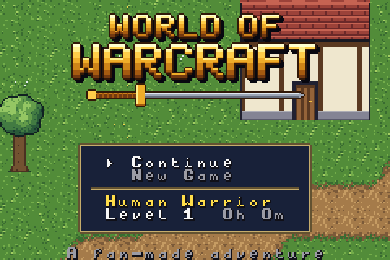
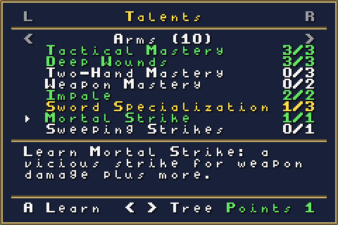
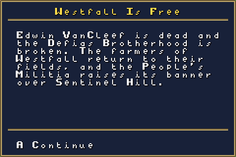
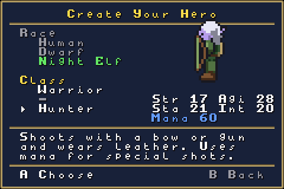
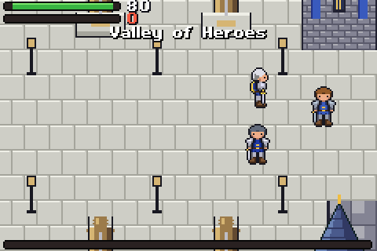
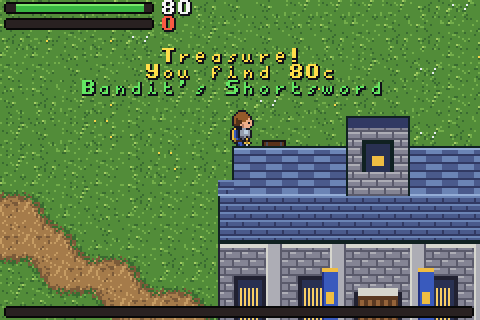
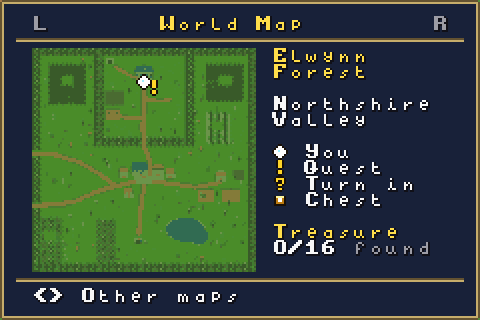
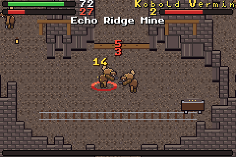
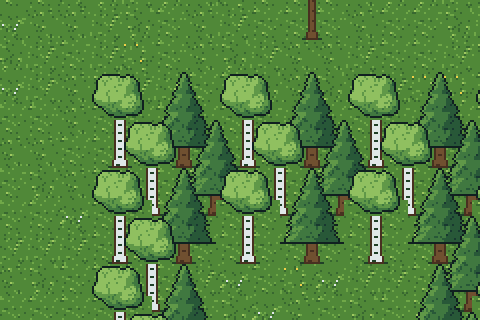

# GBA WoW

A private hobby project: a World of Warcraft-inspired open-world RPG for the Game Boy Advance,
written in C++ with [Butano](https://github.com/GValiente/butano). It will never be published.













## Status

Every milestone of the roadmap is in. From the title screen, continue your saved hero or create a
Human Warrior or Mage, a Dwarf Warrior or Hunter, or a Night Elf Warrior or Hunter, then walk freely from Northshire Abbey down to Goldshire,
west to the city of Stormwind and south to Westfall, take on 26 quests from Northshire to the
Deadmines, fight with auto-attack and your class's abilities, loot and equip about 170 items, buy and
sell at vendors, learn new ranks from your class trainer, spend talent points from level 10, face the
elites Princess and Hogger, clear the kobolds out of Echo Ridge and Fargodeep mines, hunt for 16
hidden treasure chests, hearth home to an inn, fight through the Deadmines to Sneed and Edwin
VanCleef, see the story's end, and save to the cartridge. Every zone has its own music, and elite
fights switch to a boss tune.

Following the quests in order takes a hero to about level 17 at the Deadmines and close to level 20 by
the end, without grinding.

| Milestone | What it adds | State |
| --- | --- | --- |
| M0 Toolchain ready | Butano + devkitARM build, CI | Done |
| M1 Free movement | 8-direction pixel movement, collision, camera | Done |
| M2 Open world | Elwynn Forest, Westfall, interiors, doors, area names | Done |
| M3 First playable: combat | Auto-attack, Heroic Strike, rage, wolves | Done |
| M4 Quests and NPCs | Dialogue, quest log, XP rewards | Done |
| M5 Levels, gear and trainers | Stats, equipment, loot, vendors, skill trainer, saves | Done |
| M6 Talents and second area | Warrior talent trees, Westfall-style area | Done |
| M7 Dungeon and boss | Dungeon interior, multi-phase boss | Done |
| M8 More races and classes | Character creation, Dwarf, Night Elf, Mage, Hunter | Done |
| M9 Polish | Title screen, music, sound effects, balance | Done |
| M10 Stormwind and exploration | Stormwind city, mine maps, hidden chests, world map, more trees and bushes | Done |

## Controls

| Button | Action |
| --- | --- |
| D-pad | Walk (8 directions) |
| B (hold) | Run (out of combat) |
| A | Talk to someone next to you, loot a corpse, or attack the nearest enemy |
| L | Switch target |
| R (hold) | Show the action bar; then A, B, L or a D-pad direction uses that slot |
| Select | A healing potion in combat, otherwise food or drink |
| Start | Menu: character, bags, spellbook, talents, quest log, world map and system pages (L and R switch pages) |

Talents: every level from 10 gives a point. Each class has three trees of eight talents; a tree's next
row opens after three points in it, and the last row teaches an ability (Mortal Strike, Bloodthirst,
Last Stand for warriors). Class trainers unlearn talents for 10 silver.

The hearthstone in your bags takes you back to your home inn every ten minutes; innkeepers in
Goldshire, Stormwind's Trade District and at Sentinel Hill can make their inn your home.

Stormwind is reached by the road west from Goldshire. Its districts have weapon, armor and goods
vendors, a trainer for every class, and the quest givers who send you on to Highlord Bolvar in the keep.

Treasure chests are hidden around the world: under roofs, behind buildings, at the end of side
tunnels, and in clearings reached by secret paths through the forests (look for gaps between tree
trunks). Walk up to a chest and press A to open it for money, an item and sometimes a potion. Each
chest opens once per hero. The world map (Start, then the World Map page) shows where you are, quest
givers with a `!` or `?`, the chests you have already opened, and how many of the 16 you have found;
left and right show the other zones. Brann Bronzebeard in Stormwind pays for five opened chests.

Bosses: Sneed calls an engineer at two thirds of his health and, from half health, throws saw blades
at the spot marked on the ground under you. Edwin VanCleef calls a Blackguard at 70% and 30% and, from
half health, marks a whirl of blades around himself. Step out of the red circle before it goes off.

Auto-attack keeps going after a kill if another enemy is on you, and turns to whoever is hitting you
when your target is out of reach.

On the title screen, Continue loads your hero; New Game asks before it replaces the save, and backing
out of character creation returns to the title.

The game saves itself whenever you change zones or turn in a quest, and from the system page. The
system page also has debug options for testing: teleport, level up, extra gold and gear for your level.

## Building

The ROM is built by CI on every push: open the latest run under **Actions** and download the
`gba-wow-rom` artifact. To build locally you need the Butano submodule:

```sh
git clone --recurse-submodules https://github.com/mauricelux/gba-wow.git
cd gba-wow
```

Then either use Docker (nothing else to install):

```sh
docker run --rm -v "$PWD":/src -w /src devkitpro/devkitarm make -j4
```

or install [devkitPro](https://devkitpro.org/wiki/Getting_Started) with devkitARM and Python 3 and run `make -j4`.

Run `gba-wow.gba` in [mGBA](https://mgba.io/).

The headless runner in `tools/headless/` can start from a save file: set `MGBA_SAVE=path/to/gba-wow.sav`
before running it.

## Project layout

| Path | Contents |
| --- | --- |
| `src/`, `include/` | Game code (`gw_` prefix, namespace `gw`) |
| `graphics/` | Butano assets: indexed BMP + JSON per asset |
| `audio/` | Music (ProTracker `.mod`) and sound effects (`.wav`) |
| `tools/` | Python generators for the placeholder art and collision map |
| `tools/headless/` | Headless mGBA runner used by CI for screenshots |
| `butano/` | Butano engine (git submodule, pinned to a release) |

## Placeholder art

Character sprites, UI tiles, effects, the title logo, every map (art, collision, warps, NPC and enemy
spawns, named areas) and all music and sound effects are generated by scripts so they can be changed
quickly until real assets exist. To regenerate them (needs Python 3 with Pillow and NumPy):

```sh
cd tools
python3 gen_characters.py
python3 gen_ui.py
python3 gen_effects.py
python3 gen_title.py
python3 gen_world.py
python3 gen_audio.py
```

`gen_world.py` lays out the maps; `worldgen.py` holds the painters (trees, houses, roads, water) and
writes `graphics/map_*`, the `graphics/minimap_*` world map pictures, and the `include/gw_map_*.h`
data headers. It also checks that every NPC and chest can be walked to. `gen_audio.py` writes each tune as
chords, a melody and accompaniment styles into a ProTracker `audio/*.mod`, plus short `audio/sfx_*.wav`
sound effects; the tunes are original.

Previews are written to `tools/preview/` (not committed).
