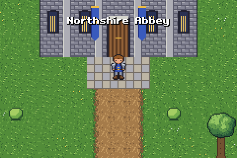
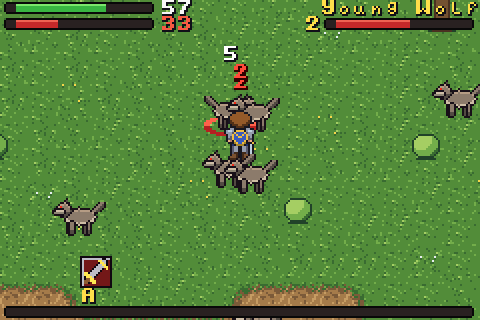
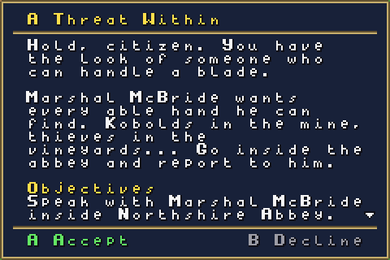
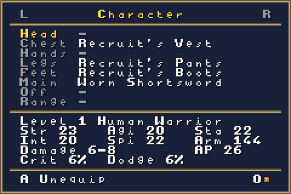

# GBA WoW

A private hobby project: a World of Warcraft-inspired open-world RPG for the Game Boy Advance,
written in C++ with [Butano](https://github.com/GValiente/butano). It will never be published.






## Status

Milestone 5 (gear and trainers) is playable: a Human Warrior walks freely from Northshire Abbey down
to Goldshire and on to Westfall, talks to the people living there, takes on 23 quests from Northshire
to the Deadmines, fights with auto-attack and rage abilities, loots and equips about 140 items, buys
and sells at vendors, learns new ranks from the class trainer, and saves to the cartridge.

| Milestone | What it adds | State |
| --- | --- | --- |
| M0 Toolchain ready | Butano + devkitARM build, CI | Done |
| M1 Free movement | 8-direction pixel movement, collision, camera | Done |
| M2 Open world | Elwynn Forest, Westfall, interiors, doors, area names | Done |
| M3 First playable: combat | Auto-attack, Heroic Strike, rage, wolves | Done |
| M4 Quests and NPCs | Dialogue, quest log, XP rewards | Done |
| M5 Levels, gear and trainers | Stats, equipment, loot, vendors, skill trainer, saves | Done |
| M6 Talents and second area | Warrior talent trees, Westfall-style area | Next |
| M7 Dungeon and boss | Dungeon interior, multi-phase boss | |
| M8 More races and classes | Character creation, Dwarf, Night Elf, Mage, Hunter | |
| M9 Polish | Title screen, music, balance | |

## Controls

| Button | Action |
| --- | --- |
| D-pad | Walk (8 directions) |
| B (hold) | Run (out of combat) |
| A | Talk to someone next to you, loot a corpse, or attack the nearest enemy |
| L | Switch target |
| R (hold) | Show the action bar; then A, B, L or a D-pad direction uses that slot |
| Select | A healing potion in combat, otherwise food or drink |
| Start | Menu: character, bags, spellbook, quest log and system pages (L and R switch pages) |

The game saves itself whenever you change zones or turn in a quest, and from the system page. The
system page also has debug options for testing: teleport, level up and extra gold.

## Building

The ROM is built by CI on every push: open the latest run under **Actions** and download the
`gba-wow-rom` artifact. To build locally you need the Butano submodule:

```sh
git clone --recurse-submodules https://github.com/mauricelux/gba-wow.git
cd gba-wow
```

Then either use Docker (nothing else to install):

```sh
docker run --rm -v "$PWD":/src -w /src devkitpro/devkitarm make -j4
```

or install [devkitPro](https://devkitpro.org/wiki/Getting_Started) with devkitARM and Python 3 and run `make -j4`.

Run `gba-wow.gba` in [mGBA](https://mgba.io/).

## Project layout

| Path | Contents |
| --- | --- |
| `src/`, `include/` | Game code (`gw_` prefix, namespace `gw`) |
| `graphics/` | Butano assets: indexed BMP + JSON per asset |
| `tools/` | Python generators for the placeholder art and collision map |
| `tools/headless/` | Headless mGBA runner used by CI for screenshots |
| `butano/` | Butano engine (git submodule, pinned to a release) |

## Placeholder art

Character sprites, UI tiles, effects and every map (art, collision, warps, NPC and enemy spawns, named areas) are
generated by scripts so they can be changed quickly until real art exists. To regenerate them (needs
Python 3 with Pillow and NumPy):

```sh
cd tools
python3 gen_characters.py
python3 gen_ui.py
python3 gen_effects.py
python3 gen_world.py
```

`gen_world.py` lays out the maps; `worldgen.py` holds the painters (trees, houses, roads, water) and
writes `graphics/map_*` plus the `include/gw_map_*.h` data headers.

Previews are written to `tools/preview/` (not committed).
